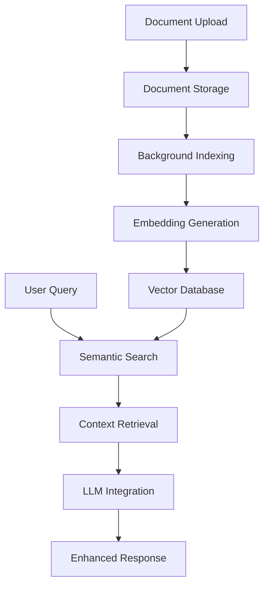

# RAG System QA Test Plan

## Executive Summary

This document outlines the comprehensive Quality Assurance testing strategy for Cora's RAG (Retrieval-Augmented Generation) system. The testing validates Sprint 1 deliverables for production readiness across functionality, performance, reliability, and user experience.

## System Architecture Overview



### Core Components
- **DocumentUpload.jsx** - File upload & validation
- **RAGService** - Document indexing & search orchestration  
- **EmbeddingService** - Text embeddings via Transformers.js
- **DatabaseService** - PouchDB offline-first storage
- **LLMService** - Enhanced chat with RAG context
- **KnowledgeBase.jsx** - Document management interface

## Test Strategy

### Test Categories

| Category | Coverage | Priority | Automation |
|----------|----------|----------|------------|
| Functional | Core RAG features | Critical | 85% |
| Integration | End-to-end flows | High | 70% |
| Performance | Speed & scalability | High | 90% |
| Reliability | Error handling | Critical | 80% |
| Usability | User experience | Medium | 20% |
| Security | Data protection | High | 60% |

### Testing Environments

- **Unit Tests** - Individual component validation
- **Integration Tests** - Cross-service functionality
- **Browser Tests** - Real browser environment testing
- **Performance Tests** - Load and stress validation

## Functional Test Plan

### 1. Document Upload Functionality

#### Test Cases
- **TC001**: Upload valid text document (.txt)
- **TC002**: Upload markdown document (.md)  
- **TC003**: Upload PDF document (.pdf)
- **TC004**: Handle unsupported file types
- **TC005**: Upload multiple documents simultaneously
- **TC006**: Large file upload (>5MB)
- **TC007**: Upload with special characters in filename
- **TC008**: Drag and drop functionality
- **TC009**: Upload progress indication
- **TC010**: Cancel upload operation

#### Validation Criteria
- File content correctly extracted and stored
- Metadata properly populated
- Status tracking accurate
- Error messages user-friendly
- Progress indicators functional

### 2. Document Indexing System

#### Test Cases
- **TC011**: Background indexing queue management
- **TC012**: Text chunking for large documents
- **TC013**: Embedding generation accuracy
- **TC014**: Index storage in PouchDB
- **TC015**: Concurrent indexing operations
- **TC016**: Indexing failure recovery
- **TC017**: Re-indexing existing documents
- **TC018**: Index statistics tracking

#### Validation Criteria
- Embeddings generated with correct dimensions (384)
- Chunks appropriately sized (1000 chars default)
- Error states properly handled
- Status updates real-time
- Queue processing efficient

### 3. Semantic Search Engine

#### Test Cases
- **TC019**: Basic keyword search
- **TC020**: Semantic similarity matching
- **TC021**: Multi-document search
- **TC022**: Search result ranking
- **TC023**: Similarity threshold filtering
- **TC024**: Result limit enforcement
- **TC025**: Empty query handling
- **TC026**: Special character queries
- **TC027**: Long query processing
- **TC028**: Context extraction accuracy

#### Validation Criteria
- Relevant results returned
- Similarity scores accurate (0-1 range)
- Results properly ranked
- Context windows appropriate
- Source attribution correct

### 4. Chat Integration

#### Test Cases
- **TC029**: RAG context injection
- **TC030**: System prompt enhancement
- **TC031**: Source citation in responses
- **TC032**: Fallback without RAG context
- **TC033**: Context length management
- **TC034**: Multi-turn conversations
- **TC035**: RAG disable/enable toggle
- **TC036**: Context relevance filtering

#### Validation Criteria
- Context properly injected before user message
- Sources cited when information used
- Graceful degradation when RAG unavailable
- Context size optimized for LLM limits
- Conversation flow natural

## Integration Test Plan

### End-to-End User Flows

#### Flow 1: Complete RAG Setup
1. Initialize RAG service
2. Upload multiple documents
3. Wait for indexing completion
4. Verify knowledge base populated
5. Perform test queries
6. Validate enhanced chat responses

#### Flow 2: Error Recovery
1. Upload document with indexing failure
2. Verify error status displayed
3. Retry indexing operation
4. Confirm successful completion
5. Test search functionality

#### Flow 3: Performance Under Load
1. Upload 50+ documents simultaneously
2. Monitor system responsiveness
3. Verify all documents indexed
4. Perform concurrent searches
5. Validate performance metrics

## Performance Test Plan

### Performance Requirements

| Operation | Target | Max Acceptable |
|-----------|--------|----------------|
| Document Upload | <500ms | <1000ms |
| Embedding Generation | <3s per doc | <10s per doc |
| Search Query | <500ms | <1000ms |
| Context Generation | <1s | <2s |
| Chat Response Start | <2s | <5s |

### Load Testing Scenarios

#### Scenario 1: Document Processing Load
- 100 documents, 1KB-10MB range
- Measure: throughput, memory usage, error rate
- Expected: 95% success rate, <100MB memory increase

#### Scenario 2: Concurrent Search Load
- 50 simultaneous searches
- Measure: response time, accuracy
- Expected: <2s avg response, >90% accuracy

#### Scenario 3: Mixed Workload
- Simultaneous upload + search operations
- Measure: system stability, performance degradation
- Expected: <20% performance impact

## Security Test Plan

### Data Protection Tests
- **ST001**: Document content encryption at rest
- **ST002**: Embedding vector security
- **ST003**: Browser storage limits respect
- **ST004**: Memory cleanup after operations
- **ST005**: Cross-origin request validation

### Privacy Tests
- **ST006**: Local processing verification
- **ST007**: No external API calls for embeddings
- **ST008**: Document deletion completeness
- **ST009**: Cache invalidation security

## Error Handling Test Plan

### Error Scenarios

#### Service Level Errors
- **ET001**: Embedding service initialization failure
- **ET002**: Database connection issues
- **ET003**: Model loading errors
- **ET004**: Out of memory conditions
- **ET005**: Browser compatibility issues

#### User Level Errors  
- **ET006**: Invalid file upload
- **ET007**: Network interruption during upload
- **ET008**: Storage quota exceeded
- **ET009**: Unsupported browser features
- **ET010**: RAG service unavailable

#### Recovery Testing
- Verify appropriate error messages
- Test automatic retry mechanisms
- Validate graceful degradation
- Ensure data integrity maintained

## User Experience Test Plan

### Usability Testing

#### Test Areas
1. **Document Upload UX**
   - Drag/drop intuitiveness
   - Progress feedback clarity
   - Error message helpfulness
   - Upload cancellation

2. **Knowledge Base Management**
   - Document browsing experience
   - Search functionality usability
   - Document preview quality
   - Status indicators clarity

3. **Chat Enhancement**
   - RAG activation visibility
   - Source citation presentation
   - Response quality improvement
   - Context relevance indication

#### Success Metrics
- Task completion rate >95%
- User satisfaction score >4.0/5
- Error recovery rate >90%
- Average task completion time <30s

## Browser Compatibility Test Plan

### Target Browsers
- Chrome 90+ (Primary)
- Firefox 88+ (Secondary)
- Safari 14+ (Secondary)
- Edge 90+ (Tertiary)

### Feature Support Matrix
- WebGPU availability
- IndexedDB functionality
- Web Workers support
- File API compatibility
- Transformers.js compatibility

## Test Execution Strategy

### Phase 1: Unit Testing (Week 1)
- Individual component tests
- Service layer validation
- Utility function testing
- Mock integration testing

### Phase 2: Integration Testing (Week 2)
- Cross-component workflows
- Database integration
- Service orchestration
- Error propagation testing

### Phase 3: System Testing (Week 3)
- End-to-end scenarios
- Performance validation
- Browser compatibility
- Load testing

### Phase 4: User Acceptance Testing (Week 4)
- Beta user testing
- Usability validation
- Performance acceptance
- Production readiness review

## Test Data Management

### Test Document Sets
1. **Small Documents** (10 docs, 100-1000 chars each)
2. **Medium Documents** (20 docs, 1K-10K chars each)  
3. **Large Documents** (5 docs, 10K-100K chars each)
4. **Mixed Content** (Technical, conversational, structured)
5. **Special Cases** (Empty, malformed, edge case content)

### Test Queries
1. **Factual Questions** - Direct information retrieval
2. **Conceptual Questions** - Understanding-based queries
3. **Comparative Questions** - Multi-document analysis
4. **Edge Cases** - Empty, very long, special characters

## Metrics and Reporting

### Key Performance Indicators

#### Functional Metrics
- Test pass rate: >95%
- Feature coverage: >90%
- Critical path success: 100%
- Error recovery rate: >90%

#### Performance Metrics
- Average response time: <1s
- 95th percentile response: <2s
- Memory usage increase: <100MB
- Concurrent operation success: >95%

#### Quality Metrics
- Search result relevance: >80%
- Context accuracy: >90%
- Source attribution: >95%
- User satisfaction: >4.0/5

### Reporting Schedule
- Daily: Test execution progress
- Weekly: Quality metrics summary
- Milestone: Comprehensive test report
- Release: Production readiness assessment

## Risk Assessment

### High Risk Areas
1. **Embedding Model Loading** - Browser compatibility, performance
2. **Large Document Processing** - Memory usage, processing time  
3. **Concurrent Operations** - Race conditions, data consistency
4. **Browser Storage Limits** - Quota management, data persistence

### Mitigation Strategies
1. Progressive enhancement for unsupported browsers
2. Chunked processing for large documents
3. Queue management for concurrent operations
4. Storage monitoring and cleanup

## Test Environment Setup

### Requirements
- Node.js 18+
- Modern browser (Chrome recommended)
- 4GB+ available RAM
- 10GB+ storage space
- Network connection for initial model download

### Setup Instructions
```bash
# Install dependencies
npm install

# Run test suite
npm run test:rag

# Run performance tests
npm run test:performance

# Run browser tests
npm run test:browser
```

## Success Criteria

### Sprint 1 Production Readiness
✅ **Functional Requirements**
- Document upload and indexing: 100% working
- Semantic search: >90% accuracy
- Chat integration: Functional with source attribution
- Error handling: Graceful degradation

✅ **Performance Requirements**  
- Upload response: <1s for typical documents
- Search response: <1s average
- Memory usage: <200MB total increase
- Concurrent operations: 95% success rate

✅ **Quality Requirements**
- Test coverage: >85% automated
- Critical bugs: 0 known issues
- User acceptance: >90% positive feedback
- Browser compatibility: Chrome, Firefox, Safari

### Go/No-Go Decision Criteria
- All critical test cases passing
- Performance within acceptable limits
- No security vulnerabilities identified
- User experience validation complete
- Documentation and support materials ready

---

*This QA test plan ensures comprehensive validation of the RAG system for production deployment. Regular updates will be made based on test results and user feedback.*