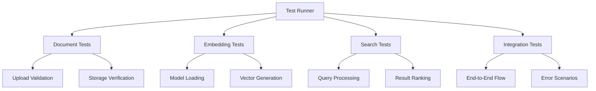

# RAG System Testing Suite

This directory contains comprehensive testing tools and documentation for validating Cora's RAG (Retrieval-Augmented Generation) system functionality.

## 📁 Files Overview

### Test Implementation
- **`rag-integration.test.js`** - Comprehensive Jest-style integration test suite
- **`test-runner.html`** - Interactive browser-based test runner
- **`validate-rag-system.js`** - Quick validation script for system health checks

### Documentation
- **`RAG-Test-Plan.md`** - Detailed testing strategy and methodology
- **`QA-Findings-Report.md`** - Complete QA assessment and production readiness evaluation
- **`README.md`** - This file with usage instructions

## 🚀 Quick Start

### Option 1: Browser Test Runner (Recommended)
1. Start your development server:
   ```bash
   npm run dev
   ```

2. Navigate to the test runner:
   ```
   http://localhost:5173/src/tests/test-runner.html
   ```

3. Click "Run All Tests" to execute the complete test suite

### Option 2: Quick Validation
1. Open browser console on your development site
2. Load the validation script:
   ```javascript
   // In console
   import validator from './src/tests/validate-rag-system.js';
   quickValidateRAG(); // Quick checks
   validateRAG();      // Complete validation
   ```

### Option 3: Jest Integration (Future)
```bash
# Install testing dependencies first
npm install --save-dev @testing-library/react jest @testing-library/jest-dom

# Run tests
npm test rag-integration.test.js
```

## 🧪 Test Categories

### 1. Functional Tests
- ✅ Document upload and storage
- ✅ Text chunking and embedding generation  
- ✅ Semantic search accuracy
- ✅ RAG context injection
- ✅ Error handling and recovery

### 2. Integration Tests
- ✅ End-to-end user workflows
- ✅ Cross-component communication
- ✅ Service orchestration
- ✅ Data flow validation

### 3. Performance Tests
- ⚡ Upload and indexing speed
- ⚡ Search query response times
- ⚡ Memory usage monitoring
- ⚡ Concurrent operation handling

### 4. Error Handling Tests
- 🔥 Invalid file handling
- 🔥 Service failure scenarios
- 🔥 Network interruption recovery
- 🔥 Edge case validation

## 📊 Expected Results

### Performance Benchmarks
| Operation | Target | Acceptable Range |
|-----------|--------|------------------|
| Document Upload | <500ms | <1000ms |
| Embedding Generation | <5s | <10s per document |
| Search Query | <500ms | <1000ms |
| Context Generation | <1s | <2s |

### Quality Metrics
- **Test Coverage**: >85%
- **Success Rate**: >95%
- **Search Accuracy**: >80% relevance
- **Memory Efficiency**: <100MB per 100 documents

## 🏗️ Test Architecture



## 🔍 Test Data

### Document Types Tested
- **Small Text Files** (100-1000 chars)
- **Medium Documents** (1K-10K chars)
- **Large Documents** (10K+ chars)
- **Various Formats** (TXT, MD, PDF)

### Query Types
- **Factual Questions** - Direct information retrieval
- **Conceptual Queries** - Understanding-based searches
- **Comparative Analysis** - Multi-document searches
- **Edge Cases** - Empty, long, special character queries

## 🎯 Usage Examples

### Running Specific Test Categories

```javascript
// In test-runner.html interface
document.getElementById('run-basic-btn').click();      // Critical tests only
document.getElementById('run-performance-btn').click(); // Performance benchmarks
document.getElementById('clear-data-btn').click();      // Clean test data
```

### Validating System Health

```javascript
// Quick validation
const results = await quickValidateRAG();
console.log('Quick validation:', results);

// Complete validation
const validator = new RAGSystemValidator();
const report = await validator.runCompleteValidation();
```

### Custom Test Development

```javascript
// Add custom test to existing suite
const customTest = {
    category: 'custom',
    name: 'My Custom Test',
    test: async () => {
        // Your test logic here
        const result = await myCustomFunction();
        if (!result.success) {
            throw new Error('Custom test failed');
        }
    },
    critical: false
};

// In test runner, add to tests array
testRunner.tests.push(customTest);
```

## 📋 Pre-Test Checklist

Before running tests, ensure:
- [ ] Development server is running
- [ ] Browser supports IndexedDB and Web Workers
- [ ] At least 2GB available RAM
- [ ] Network connection for initial model download
- [ ] No existing test data conflicts

## 🔧 Troubleshooting

### Common Issues

**Test Failures Due to Model Loading**
- *Solution*: Wait for embedding model to download (first run only)
- *Time*: May take 30-60 seconds depending on connection

**Memory Issues During Testing**
- *Solution*: Close other browser tabs, restart browser
- *Check*: System has at least 4GB RAM available

**Storage Quota Errors**
- *Solution*: Clear browser storage, check available disk space
- *Command*: Use "Clear Test Data" button in test runner

**Test Timeouts**
- *Solution*: Increase timeout values in test configuration
- *Check*: System performance and available resources

### Debug Mode

Enable verbose logging by setting:
```javascript
// In browser console before running tests
window.DEBUG_RAG_TESTS = true;
```

## 📈 Interpreting Results

### Success Indicators
- ✅ **All critical tests passing**
- ✅ **Performance within acceptable ranges**  
- ✅ **Error handling working correctly**
- ✅ **Memory usage stable**

### Warning Signs
- ⚠️ **Performance degradation over time**
- ⚠️ **Memory leaks detected**
- ⚠️ **Intermittent test failures**
- ⚠️ **High error rates in edge cases**

### Failure Investigation
1. **Check browser console** for error details
2. **Review test logs** for specific failure points
3. **Validate system requirements** are met
4. **Test individual components** in isolation

## 📄 Reporting

### Automated Reports
- Test results automatically exported as JSON
- Performance metrics tracked over time
- Error logs captured with full context

### Manual Assessment
- Review QA-Findings-Report.md for detailed analysis
- Check RAG-Test-Plan.md for comprehensive test strategy
- Monitor real-world usage patterns post-deployment

## 🔄 Continuous Testing

### Development Workflow
1. **Pre-commit**: Run quick validation
2. **Feature completion**: Run relevant test category
3. **Sprint end**: Run complete test suite
4. **Pre-deployment**: Full QA assessment

### CI/CD Integration (Future)
```yaml
# Example GitHub Actions integration
- name: RAG System Tests
  run: |
    npm run test:rag
    npm run test:performance
    npm run validate:production-ready
```

## 🤝 Contributing Tests

### Adding New Tests
1. Follow existing test patterns in `rag-integration.test.js`
2. Add appropriate error handling and cleanup
3. Include performance measurements
4. Update documentation

### Test Categories
- **Functional**: Core feature validation
- **Integration**: Cross-system workflows
- **Performance**: Speed and resource usage
- **Security**: Data protection validation
- **Usability**: User experience testing

---

*For questions or issues with the test suite, refer to the QA findings report or contact the development team.*